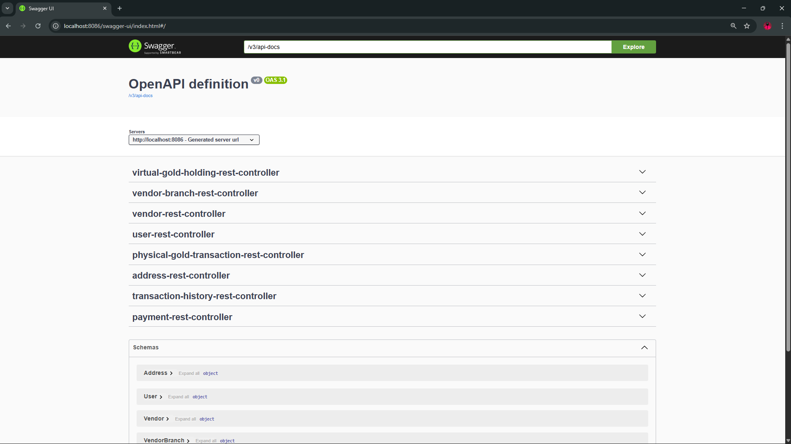
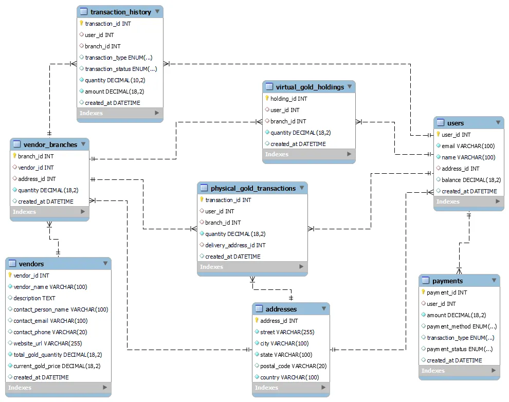

<a href="https://balajivs.me"></a>

# DigitalGoldLoanV3 - SpringRESTapi

The **Digital Gold Loan** is a complete **Spring Boot monolith** backend designed to manage all aspects of digital gold transactions.
It exposes only **REST endpoints** (no UI or Thymeleaf), making it ideal for integration with frontend frameworks (React, Angular, Vue) or mobile apps.
This README explains the project setup, configuration, representative endpoints, run instructions, and future plans for scaling the architecture.

---

## 📑 Table of Contents

1. [Project Overview](#-project-overview)
2. [Technology Stack](#-technology-stack)
3. [Screenshots](#️-screenshots)
4. [Project Structure](#-project-structure)
5. [Application Configuration](#-application-configuration)
6. [Database Setup](#️-database-setup-mysql)
7. [REST API Endpoints](#-rest-api-endpoints)
8. [Validations](#-validations)
9. [Global Exception Handling](#-global-exception-handling)
10. [Prerequisites](#-prerequisites)


---

## 📌 Project Overview

This project is ideal for learning or deploying a secure, enterprise-grade digital gold wallet solution, with a clear path for microservice migration.

The API enables secure and efficient handling of the entire digital gold lifecycle:

- **User Management:** Register new users, update profiles, fetch user details, and manage authentication.
- **Vendor Management:** Add, update, and list gold vendors who sell or buy gold from the platform.
- **Gold Purchase & Sale:** Handle buying and selling operations for digital gold.
- **Transaction History:** Store and retrieve the entire history of a user’s gold transactions.
- **Wallet Balance Tracking:** Maintain and fetch current gold holdings (digital or physical).
- **Vendor Branch Operations:** Manage vendor branch details like addresses and contact info.

The architecture follows a Controller → Service → Repository pattern, ensuring a clean separation of concerns and easier migration to microservices.

---

## 💻 Technology Stack

This backend is built with enterprise-grade technologies:

- **Java 17:** Modern, stable, and efficient programming language.
- **Spring Boot 3.5.6:** Framework for building production-ready applications quickly.
- **Spring Web:** For developing RESTful web services.
- **Spring Data JPA:** For database interaction with minimal boilerplate.
- **MySQL:** Relational database for secure and structured data storage.
- **Maven:** Dependency management and build automation.

---

## 🖼️ Screenshots

### DigitalGoldLoan SwaggerUI



### DigitalGoldLoan ER Diagram



---

## 📂 Project Structure

The project follows a standard Maven structure for Spring Boot applications, designed for maintainability and clarity:

```
DigitalGoldLoanV3/
 ├── src/
 │   ├── main/
 │   │   ├── java/com/...      # Controllers, Services, Repositories, Entities (domain logic)
 │   │   └── resources/
 │   │       └── application.properties # Main configuration file
 │   └── test/                 # Unit and integration tests
 ├── pom.xml                   # Maven dependencies and build configuration
 └── README.md (this file)     # Complete project documentation
```

**Key Concepts:**

- **Controller:** Handles HTTP requests and delegates to services.
- **Service:** Contains business logic and orchestration.
- **Repository:** Interfaces with the database.
- **Entities:** Represent the data model.

---

## ⚙ Application Configuration

All configuration values are defined in `src/main/resources/application.properties`.  
These control the application's identity, port, database credentials, and persistence settings.

**Sample:**

```
spring.application.name=DigitalGoldLoanV3
server.port=8080
spring.datasource.url=jdbc:mysql://localhost:3306/digitalgoldloan
spring.datasource.username=root
spring.datasource.password=YOUR_PASSWORD

spring.jpa.hibernate.ddl-auto=update       # Creates/updates DB tables based on Entities
spring.jpa.show-sql=true                   # Logs SQL queries for easier debugging
spring.jpa.properties.hibernate.format_sql=true
```

**Tips:**

- Use strong passwords and restrict MySQL access for production.
- `ddl-auto=update` is convenient for dev, but use `validate` or migrations for production.

---

## Database Setup (MySQL)

### 1. Start MySQL

Ensure your MySQL server is running.

### 2. Create the Database

Use the following SQL command to create the database with proper UTF-8 support:

```sql
CREATE DATABASE digitalgoldloan;

USE digitalgoldloan;
```

### 3. Configure Credentials

Set your MySQL credentials in the application.properties file:

```bash

spring.datasource.url=jdbc:mysql://localhost:3306/digitalgoldloan
spring.datasource.username=your_username
spring.datasource.password=your_password
```

### 4. Table Creation

On first run, tables will be auto-created or altered if you use:

```bash
spring.jpa.hibernate.ddl-auto=update
```

---

## 🌐 REST API Endpoints

Below are sample endpoints — only 1–2 examples per entity from the total 64 available.

All endpoints follow the /api/v3/ pattern, use JSON for request/response, and are accessible via HTTP.

**1️⃣ User**

```bash
GET    /api/v3/users               # Retrieve all registered users
GET    /api/v3/users/{user_id}     # Retrieve a specific user by ID
```

**2️⃣ Vendor**

```bash
GET    /api/v3/vendors             # Retrieve all vendors
POST   /api/v3/vendors/add         # Add a new vendor
```

**3️⃣ Vendor Branch**

```bash
GET    /api/v3/vendor-branches         # Retrieve all vendor branches
POST   /api/v3/vendor-branches/add     # Create a new vendor branch
```

**4️⃣ Virtual Gold Holding**

```bash
GET    /api/v3/virtual-gold/{user_id}   # Get a user's virtual gold holdings
POST   /api/v3/virtual-gold/buy         # Buy virtual gold
```

**5️⃣ Physical Gold Transaction**

```bash
GET    /api/v3/physical-gold                         # List all physical gold transactions
POST   /api/v3/physical-gold/convertToPhysical       # Sell physical gold
```

**6️⃣ Transaction History**

```bash
GET    /api/v3/transactions             # Retrieve all transactions
GET    /api/v3/transactions/{txn_id}    # Retrieve transaction by ID
```

**7️⃣ Payment**

```bash
POST   /api/v3/payments/add             # Create a new payment
GET    /api/v3/payments/{payment_id}    # Retrieve payment details
```

**8️⃣ Address**

```bash
GET    /api/v3/address/{user_id}        # Retrieve addresses for a specific user
POST   /api/v3/address/add              # Add a new address
```

---

## ✅ Validations

The application leverages the **Spring Validation API** (`jakarta.validation`) to enforce data integrity and business rules on both forms and API requests.

**Common Validation Annotations:**

- `@NotNull`, `@NotBlank`: Ensure required fields are present.
- `@Size`: Restrict length of text fields.
- `@Email`: Validate proper email address format.
- `@Pattern`: Custom regex for field formats (e.g., phone numbers).

**Integration with Thymeleaf:**

- Validation errors are automatically passed to the view and surfaced using `${#fields.errors('fieldName')}` for a better user experience.

**Localization:**

- All validation messages can be customized and localized via `application.properties` or `messages.properties`.

---

## 🛡 Global Exception Handling

A robust global exception handler (`@RestControllerAdvice`) centralizes error management for user-friendly and secure error responses.

**Custom Exceptions Handled:**

- `AddressException`
- `PaymentException`
- `PhysicalGoldTransactionException`
- `TransactionHistoryException`
- `UserException`
- `VendorBranchException`
- `VendorException`
- `VirtualGoldHoldingException`

**Validation Exceptions:**

- `MethodArgumentNotValidException`
- `ConstraintViolationException`

**Generic Handling:**

- Any uncaught exception returns a 500 Internal Server Error with a safe, generic message (protecting sensitive details).

---

## 📋 Prerequisites

To run and develop this project, ensure the following:

- **Java 17+**: Download from [Oracle](https://www.oracle.com/java/technologies/downloads/)
- **Maven 3.x**: [Download Maven](https://maven.apache.org/download.cgi) and add to PATH.
- **MySQL Server**: Create a database named `digitalgoldloan`.
- **IDE:** Recommended: IntelliJ IDEA, Spring Tool Suite, or Eclipse